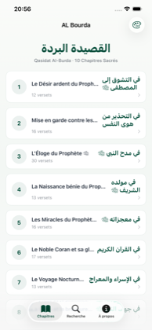
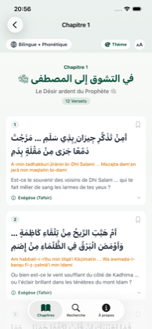
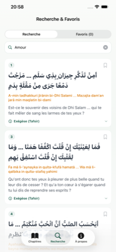
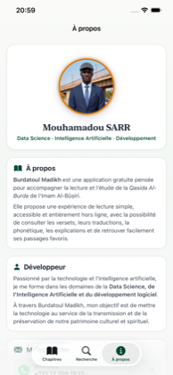
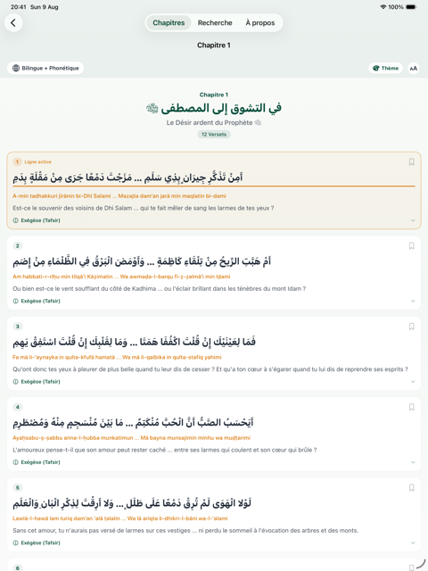

<div align="center">


# Burdatoul Madikh
### القصيدة البردة

**Une application iOS native pour lire, méditer et étudier la Qasidat Al-Burda**
*Le Poème du Manteau — Imam Sharaf ad-Din al-Būṣīrī, XIIIe siècle*

[](https://swift.org)
[](https://developer.apple.com/ios/)
[](https://developer.apple.com/xcode/swiftui/)
[](#-architecture-du-code)
[](#-licence)
[](#-statut-app-store-connect)

</div>

<br />

<p align="center">
  
  
  
  
</p>

<p align="center"><sub>Liste des chapitres · Lecteur trilingue avec ligne active · Recherche tolérante · À propos</sub></p>

---

Burdatoul Madikh est une application iOS native développée en **Swift** et **SwiftUI**, dédiée à la lecture, l'étude spirituelle et la méditation de la célèbre **Qasidat Al-Burda**, chef-d'œuvre de la poésie islamique composé au XIIIe siècle par l'Imam Sharaf ad-Din al-Būṣīrī.

**100 % gratuite · sans publicité · sans achat intégré · sans compte utilisateur · entièrement hors ligne.**

## Sommaire

- [Fonctionnalités](#fonctionnalités)
- [Thèmes spirituels](#thèmes-spirituels-serigne-tidiane)
- [Confidentialité](#-confidentialité--vie-privée)
- [Stack technique](#-stack-technique)
- [Architecture du code](#-architecture-du-code)
- [Arborescence du projet](#-arborescence-du-projet)
- [Statut App Store Connect](#-statut-app-store-connect)
- [À propos du développeur](#-à-propos-du-développeur)
- [Licence](#-licence)

## Fonctionnalités

| | |
|---|---|
| **160 versets canoniques** | Répartis en 10 chapitres + 2 suppléments d'invocations, texte fidèle et vérifié |
| **Lecture trilingue** | Arabe voyellé (Tashkeel), translittération phonétique latine, traduction française littéraire |
| **Ligne de lecture active** | Un tap surligne le verset en cours, avec retour haptique (`UIImpactFeedbackGenerator`) |
| **Exégèse (Tafsir)** | Contexte historique et explications linguistiques dépliables sous chaque verset |
| **Recherche tolérante** | Recherche arabe insensible aux voyelles, recherche française et phonétique instantanée |
| **Favoris** | Sauvegarde locale des versets préférés, aucune donnée envoyée à un serveur |
| **Ouverture théâtrale** | Animation de rideaux à l'entrée de chaque chapitre, ressort Apple signature |
| **RTL / LTR natif** | Alignement bi-directionnel automatique selon la langue affichée |

## Thèmes spirituels Serigne Tidiane

Trois thèmes visuels épurés, accessibles via le sélecteur en haut à droite :

| Thème | Hommage | Palette |
|---|---|---|
| Émeraude & Or | Seydi El Hadji Malick Sy (RTA) — signature Tivaouane | Vert émeraude sacré & or noble |
| Blanc épuré | Serigne Babacar Sy (RTA) | Blanc pur & platine |
| Nuit spirituelle | Mode sombre | Fond sombre reposant pour la lecture nocturne |

<p align="center">
  
</p>
<p align="center"><sub>Interface adaptative sur iPad — ligne active surlignée en direct</sub></p>

## 🔐 Confidentialité & Vie privée

- **Prix** : 100 % gratuit (0.00 €) · **Achats in-app** : aucun · **Publicité** : aucune (0 SDK de pub)
- **Compte utilisateur** : aucun requis · **Données collectées** : aucune
- `PrivacyInfo.xcprivacy` conforme iOS 16+ (`NSPrivacyTracking = false`, raison `CA92.1` pour `UserDefaults`)
- Toutes les préférences (favoris, thème, taille du texte) restent **exclusivement sur l'appareil**

## 🛠 Stack technique


Aucune dépendance tierce, aucun package externe : 100 % SwiftUI natif, animations `Spring` et micro-interactions Apple faites main.

## 🏗 Architecture du code

Architecture **MVVM** (Model-View-ViewModel) native SwiftUI :

```text
Models          → Représentation des données (Chapter, Verse, Supplement, TidianeTheme)
ViewModels      → Gestion de l'état global et des préférences (AppState)
Services        → Accès aux données JSON et moteur de recherche (DataService, SearchService)
Views           → Composants d'interface SwiftUI (Chapters, Search, Theme, About)
Utils           → Micro-interactions et animations Apple (AppleSpringButtonStyle)
```

## 📂 Arborescence du projet

```text
AL Bourda/
├── AL_BourdaApp.swift              # Point d'entrée principal iOS
├── ContentView.swift                # Barre d'onglets (Chapitres, Recherche, À propos)
├── PrivacyInfo.xcprivacy            # Déclaration de confidentialité Apple
├── Models/
│   ├── Chapter.swift                # Modèle de chapitre
│   ├── Verse.swift                  # Modèle de verset canonique
│   ├── Supplement.swift             # Modèle d'invocations/colophon
│   └── TidianeTheme.swift           # Thèmes spirituels Serigne Tidiane
├── Services/
│   ├── DataService.swift            # Chargement du JSON burda_verses.json
│   └── SearchService.swift          # Moteur de recherche tolérant sans voyelles
├── ViewModels/
│   └── AppState.swift               # État global (Favoris, thèmes, taille texte)
├── Utils/
│   └── AppleSpringButtonStyle.swift # Animations élastiques signature Apple
├── Views/
│   ├── Chapters/
│   │   ├── ChapterListView.swift    # Liste des 10 chapitres
│   │   ├── ChapterDetailView.swift  # Lecteur poétique avec ouverture des rideaux
│   │   └── VerseRowView.swift       # Composant verset (RTL, Tafsir, Favoris, Ligne active)
│   ├── Search/
│   │   └── SearchView.swift         # Interface de recherche textuelle et favoris
│   ├── Theme/
│   │   └── TidianeThemePickerView.swift # Sélecteur de thème spirituel
│   └── About/
│       └── AboutView.swift          # Profil développeur, bio et contact
└── Resources/
    ├── burda_verses.json            # Base de données officielle des 160 versets
    └── Assets.xcassets              # AppIcon 1024×1024 et portrait du développeur
```

## 🚀 Statut App Store Connect

| Champ | Valeur |
|---|---|
| **Nom** | Burdatoul Madikh |
| **Bundle Identifier** | `sn.fulani.AL-Bourda` |
| **Version** | 1.0 (build 1) |
| **Cible iOS** | 16.0+ |
| **Statut** | ⏳ Soumis, en attente de revue Apple |
| **Chiffrement** | Non (exempté) |
| **Catégorie tarifaire** | Gratuit |

## 👨‍💻 À propos du développeur

<div align="center">

**Mouhamadou SARR**
*Data Science · Intelligence Artificielle · Développement logiciel*

[](https://wa.me/221777091913)
[](mailto:sarrmahmoud232@gmail.com)
[](https://linkedin.com/in/mouhamadou-sarr1/)

</div>

> *« À travers Burdatoul Madikh, mon objectif est de mettre la technologie au service de la transmission et de la préservation de notre patrimoine culturel et spirituel. »*

## 📄 Licence

Projet distribué sous licence MIT. Libre d'utilisation pour la diffusion du patrimoine spirituel.

<div align="center">
<sub>Conçu avec soin pour les fidèles du Gamou (Mawlid) et les étudiants du patrimoine spirituel soufi.</sub>
</div>
